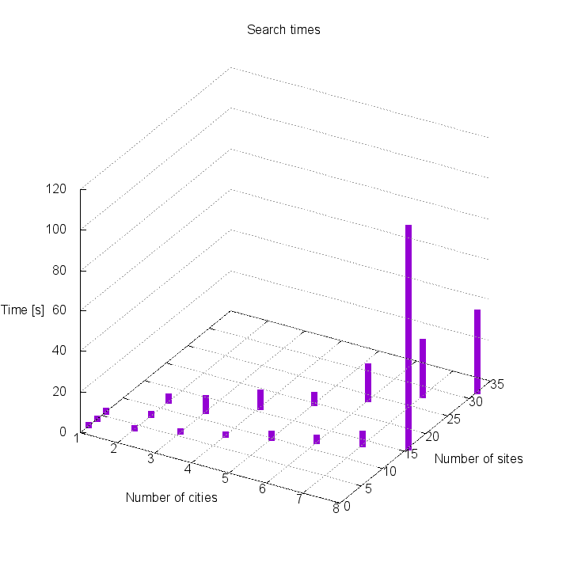
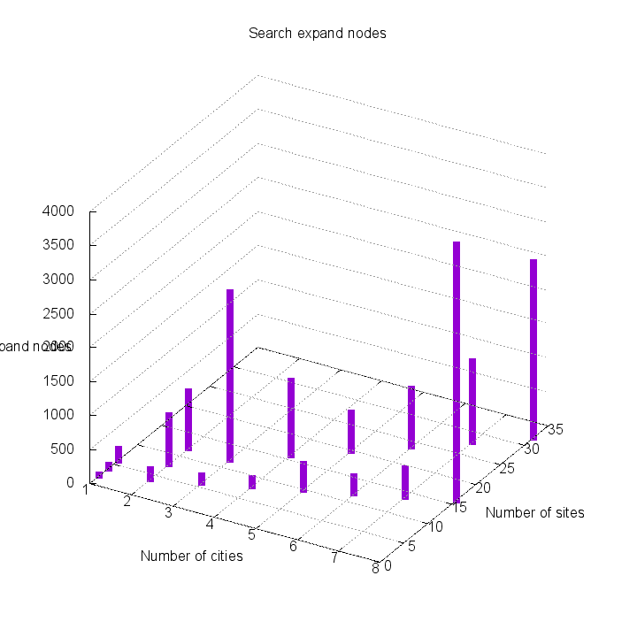
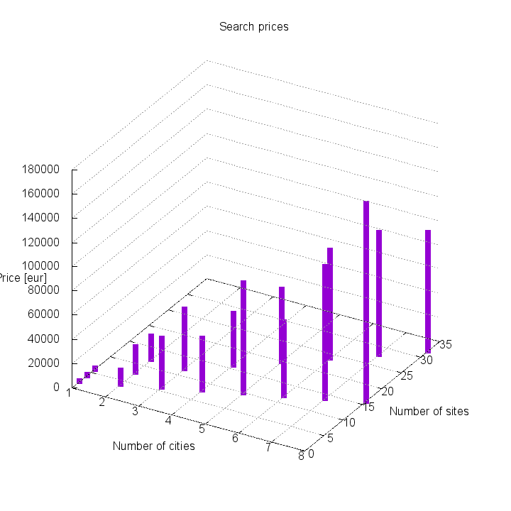
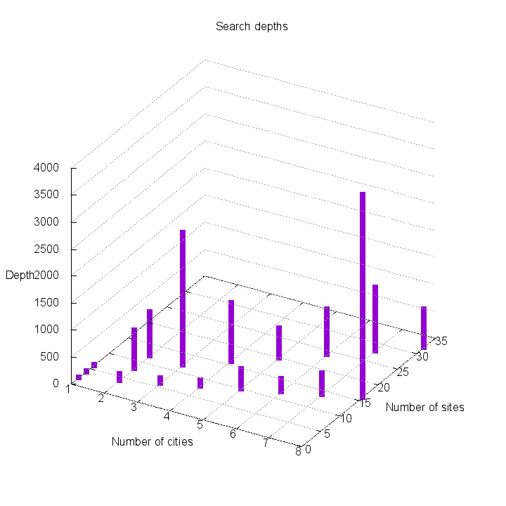
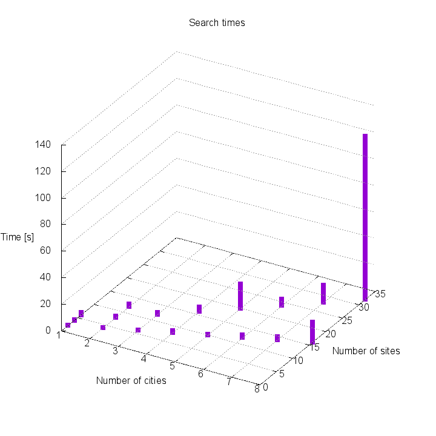
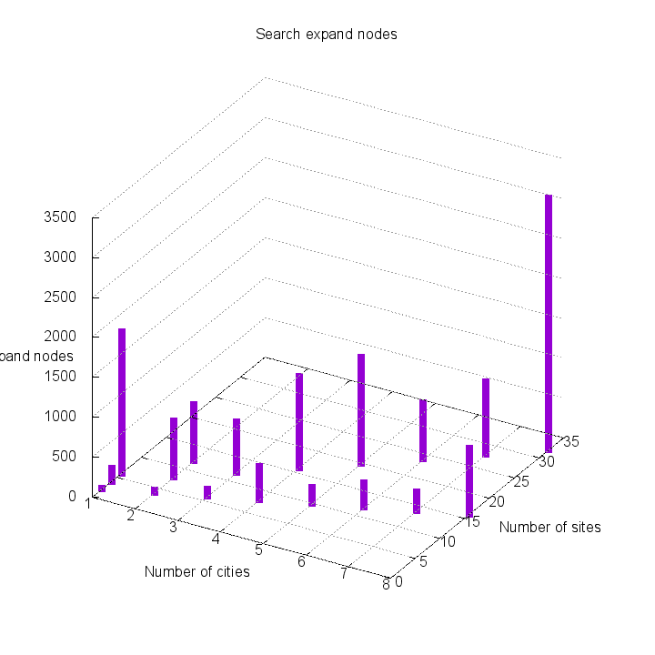
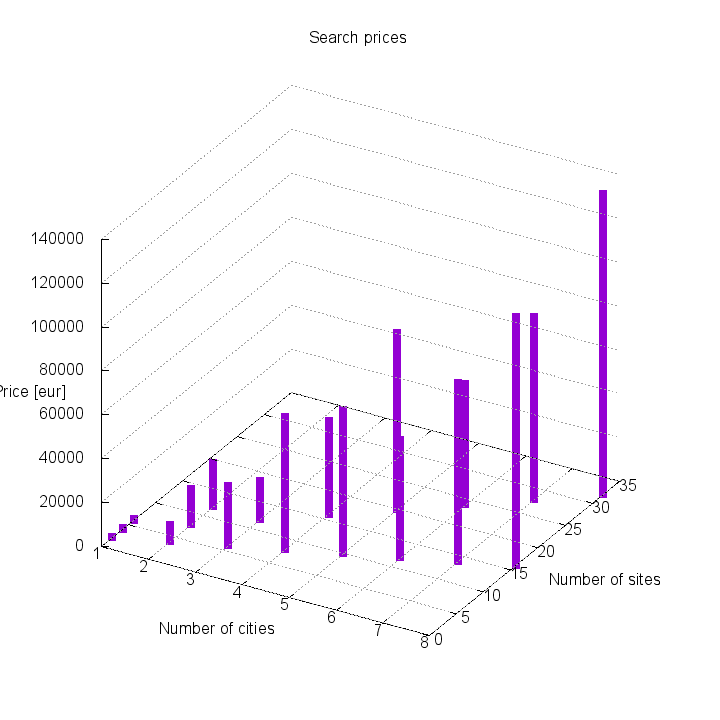
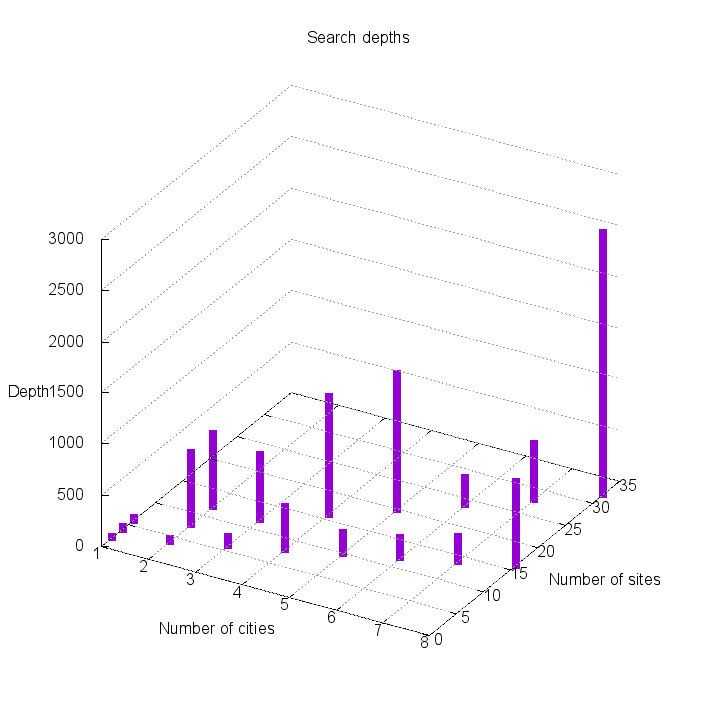

LogSolver
=========

Model
-----

Problém jsem se rozhodl řešit prohledáváním stavového prostoru. Stav reprezentuje třída State. Položky stavu jsou pole číselných identifikátorů načtených ze vstupního souboru a hashmapy nákladů pro každý dopravní prostředek. Instance stavu obsahuje pouze položky, které se mouhou menit - neměnné položky jsou jako statické.

Rozhodoval jsem se, zda do stavu ukladat přímo číselné identifikátory nebo jestli tyto pole převést na nějaké datové struktury. Výhodou prvního přístupu se mi zdála jasná velikost a struktura stavu. Druhý způsob ovšem sliboval jednoduší manipulaci a čtení informace ze stavu.

Konečné řešení nakonec kombinuje oba zmíněné přístupy - vytvořil jsem model hybridní. Ve stavu jsou tedy uložena pole identifikátorů, ale pro každý objekt v problému existuje dummy struktura skrze kterou se jednoduse získávají informace o stavu.
Následující dummy struktury se nacházejí ve jmeném prostoru DummyObjects:

- Van - reprezentuje dodávku
- Plane - reprezentuje letadlo
- City - reprezentuje město
- Place - reprezentuje výdejní místo
- Package - reprezentuje balíček

Tyto dummy struktury obsahují pouze identifikátor(číslo uložené ve stavu) a odkaz na stav. Dummy struktury se vytvařejí lazy on demand při "zkoumání" stavu, takže když nejsou potřeba, tak rovnou zanikají. 

Bylo mi jasné, že budu muset vyzkoušet několik vyhledávacích alogritmů, a tak jsem se snažil udělat objektový návrh, tak aby se jednoduše daly testovat různé řešiče problému.

Architektura
------------

### Uzel stromu

Samotný stav je vždy uložen v uzlu(prohledávaícho stromu). Každý vyhledávací algoritmus může mít uzel s trošku jinými položkami. Těchto různých implementací uzlu je možné docilít implementací rozhraní INode.

Implementované uzly ve jemném prostoru Structures:

- Node - základní implementace pro obyčejné neinformované searchery
- AStarNode - implementace s položkou pro heuristky v informovaných searcherech A* nebo IDA*.
- RBFSNode - implementace pro searcher RBFS

### Expandéry

Každému searcheru je nutné předat expandér uzlů - ten musí implementovat rozhrani INodeExpander. Expandér samotný potřebuje vytvářet uzly, ale už ho nezajímá, jak se konkrétní uzel vytváří. Jelikož můžeme mít různe typy uzlů, expandéru musíme vždy předat factory na tvorbu uzlů. Ke každému uzlu musí tak existovat jeho odpovídající factory. Expandér je tak odstíněn od samoté tvorby konkrétní uzlů a je se v něm tak možné soustředit pouze na provedení samotné expanze.

### Heuristiky

Informovaným algoritmům je zapotřebí nějak předat heuristiky. Aby bylo opět možné vytvářet různé implementace heuristik, existuje rozhrani IRemainerPriceEstimator. Konkrétní implementace heuristik se předají factories vytvářející uzly - které při vytváření uzlů provedou přímo i jejich ohodnocení.

### Akce

Pro přechod mezi stavy se používají akce, ty je možné vytvořit implementací rozhrani IAction. Samotná akce pak provadí kopie a modifikace stavů. 

Řešení problému
---------------

### Searchery

Po implementaci stavu a akcí zajištujících přechod mezi stavy jsem implementoval DummyExpander. Tento expandér expanduje uzel tak, že se snaží všechny dodávaky a všechny letadla poslat na všechna možná místa. Dále se pokouší naložit a vyložit všechny předměty do všech možných dopravnich prostředků.

### Neinformované

S tímto expandérem jsem se postupně pustil do implementace searcherů.  Začal jsem postupně s neinformovanými algoritmy BFS(BreathFirstSearch), DFS(DepthFirstSearch), IDS(IterativeDeepingSearch). Výsledky v prohledávání v tomto obsazení byly bídné už pro 1 město se 3 místy a 2 dodávakymi a s trochu více předměty nebylo možné nalézt řešení. 

### Informované

Pokračoval jsem tedy dále s informovanými algoritmy. Nejprve klasický A* s prioritní frontou (AStarBreathFirstSearch). Výsledek byl o mnoho lepší nicméně stálé se dařilo řešit pouze problémy s několika jednotkami předmětů. Navíc v tomto případě došla velmi brzy pamět. 

Pokračoval jsem implementací A* s iterativním prohlubováním (AstarIterativeDeepeningSearch). Výsledek byl o něco lepší a navíc tu nedocházel vůbec problém s pamětí.

Jako poslední jsem provedl implmentaci RBFS (RecursiveBestFirstSearch), která se ukázala jako nejlepší.

### Heuristiky

Mírného zlepšení jsem ještě dosáhl implmentací lepších heuristik. Byl jsem schopen nalézt řešní s okolo 10-20ti předmětů. Podařilo se mi naimplmentovat v podstatě 2 heuristikz fungující relativně dobře. 

###### PathRemainerPriceEstimator 

Heuristika, která pro každý balíček odhadne cenu, tak jakoby balíček musel cestovat sám. Heuristika bohužel není přípustná, nicméně zlepšuje hodně efektivitu prohledávání.

###### CountPriceEstimator

Tato heuristika napočítá počty různých věcí:
- počet balíčků, které je potřeba převést do jiného města
- počet balíčků, které je třeba převést na jiné místa
- počet míst, kde jsou balíčky, ale nejsou tam žádné dodávky
- počet míst, kde jsou balíčky, ale nejsou tam žádná letadla
- počty nevyložených balíčků z letadel a dodávek
- počty balíčků v dodávkách a letadlech

Tyto počty se pronásobí cenami příslušných akcí a všechny se sečtou.

###### CombinePriceEstimator

Heuristika kombinující různé heuristky - v mém případě konkrétně dvě předchozí. Výsledek kombinuje tak, že vybočte minimum, průměr a sumu. Jako výsledek pak vráti průměr s náhodně přičeným číslem z rozdílu sumy a průměru a náhodně odečteným číslem z rozdílu průměru a minima. Tato heuristika po provedení expermintů dávala nejlepší řešení.

### Expandéry

Doposud byl vždy použit již zmiňovaný DummyNodeExpandér, který defacto zkouší všechny moznosti. V této sestavě tak byla stále nalézána řešení pouze pro 1 město a několik jednotek balíčků a míst. Rozhodl jsem se tedy naimplementovat chytrý expandér, který bý expandované uzly nějak ořezal.

Tento expandér implementuje třída BasicNodeExpander a funguje přibližně následovně.
- prázdné dodávky(letadla) zkouší poslat na všechna možná mista s nenaloženým nákladem
- poloprázdné dodávky(letadla) zkouší posílat na všechna možná míst s nenaloženým nákladem a na všechny destinace předmětů v úložném prostoru.
- plné dodávky(letadla) zkouší posílat na všechny možné destinace předmětů v úložném prostoru
- pokud to jde snaží se naložit najednou co nejvštší možné mnžství balíčků do dodávek a letadel
- snaží se vykáládat balíčky pouze v cílových destinacích nebo na letištích

Toto je poslední implemnetované řešení přenášející následující výsledky.

Výsledky
--------

Následují výsledky testů pro pocet mest 1 až 8 a 2-6 násobek počet míst. Grafy zobrazují ceny, expandovane uzle, hloubku a realny cas.

### Závěrem 

Na následujících grafech je vidět, že výše popsaný solver si dokáže poradit i s netrivialními problémy. Na druhou stranu existuje spoustu míst na zdokonalení a tato verze je defacto výchozí. Rozhodně by stálo za to napsat lepší heuristiky - především nějakou přípustnou ale dostatečně dobrou, aby hledala rychle řešení.

V samotném expandéru je jistě mnoho míst ke z lepšení. Nejvíce mě ale láká myšlenka implementace expanderů jako neuronové sítě, která by se naučila expandovat správné akce pomocí evolučních algoritmů. Stejně tak by bylo zajimavé napsat takovou heuristiku.

Co jsem ještě nezmiňoval je, že všechny vyhledávací algoritmy(až na RBFS) jsou implementované i s podporou tree searche. Nicméně v testech s graph searchy se ukázal overhead hashovaní stavů příliš velký.

### Test 1

### Test 2

